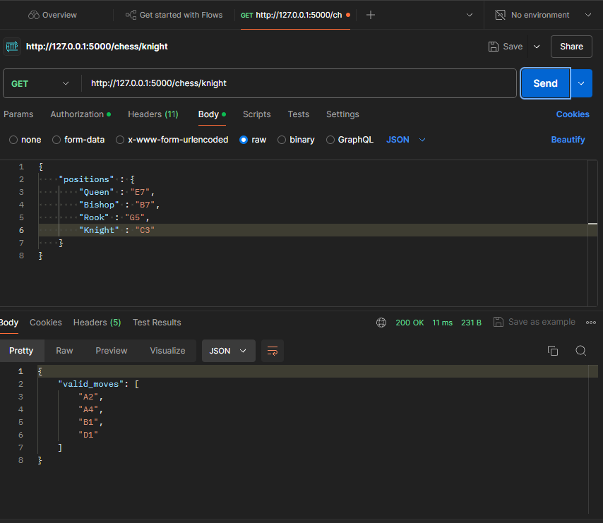

# Chess Move Validator

This README provides instructions for setting up and running a basic Flask server with a chess piece endpoint.

## Table of Contents
1. [Prerequisites](#prerequisites)
2. [Installation](#installation)
3. [Running the Server](#running-the-server)
4. [API Endpoints](#api-endpoints)
5. [Using Postman to Check Endpoints](#using-postman-to-check-endpoints)
6. [Project Structure](#project-structure)

## Prerequisites

- Python 3.6 or higher
- pip (Python package installer)

## Installation

1. Clone this repository or download the source code.

2. Navigate to the project directory:
   ```
   cd path/to/project
   ```

3. (Optional) Create and activate a virtual environment:
   ```
   python -m venv venv
   source venv/bin/activate  # On Windows, use `venv\Scripts\activate`
   ```

4. Install the required packages:
   ```
   pip install -r requirements.txt
   ```

## Running the Server

1. Run the Flask Application:
   ```
   python chess_api.py
   ```
   The server should start running on `http://127.0.0.1:5000/`.

## API Endpoints

### Chess Piece Endpoint

The server provides an endpoint for chess pieces:

```
GET /chess/<piece>
```

Replace `<piece>` with the name of a chess piece (e.g., pawn, rook, knight, bishop, queen, king).

Example usage:
```
GET /chess/knight
```

This endpoint can be used to retrieve the possible number of valid moves according to the piece in the endpoint.

## Using Postman to Check Endpoints

Follow these steps to download Postman and use it to check your Flask server endpoints:

1. **Download Postman:**
   - Visit the official Postman website: https://www.postman.com/downloads/
   - Choose the version for your operating system (Windows, macOS, or Linux)
   - Download and install the application

2. **Launch Postman:**
   - Open the Postman application on your computer

3. **Create a new request:**
   - Click on the "+" tab to create a new request

4. **Set up the request:**
   - Choose the HTTP method (GET for your chess endpoint)
   - Enter the URL: `http://127.0.0.1:5000/chess/<piece>`
     Replace `<piece>` with a chess piece name (e.g., `knight`)

5. **Send the request:**
   - Click the "Send" button

6. **View the response:**
   - The bottom pane will show the server's response
   - Check the status code, response time, and body content

7. **Test different pieces:**
   - Change `<piece>` in the URL to test different chess pieces
   - For example:
     - `http://127.0.0.1:5000/chess/pawn`
     - `http://127.0.0.1:5000/chess/queen`

8. **Save the request (optional):**
   - Click "Save" to keep this request for future use
   - Name your request and choose or create a collection to organize it

Remember to have your Flask server running while testing with Postman. If you encounter any issues, ensure your server is running and check for any error messages in your server's console.

### Example Photo:



## Project Structure

```
project/
│
├── chess_api.py     # Main application file
└── requirements.txt # Project dependencies
```